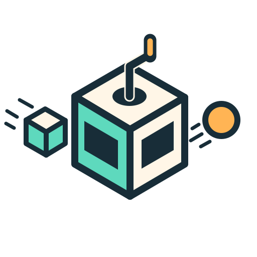

# Transmog

<p align="center">
  
</p>

**See what your apps send. Stop traffic in flight. Change it. Replay it.**

Transmog is a Windows-first web debugging proxy that turns HTTP traffic into a
live, inspectable workspace. Capture requests as they happen, select any
exchange to explore its request and response, pause traffic at breakpoints,
override behavior with reusable rules, and keep a durable record when the
interesting bug finally appears.

The desktop experience is the product: a focused traffic list and split
request/response inspector, backed by a carefully layered Rust proxy engine.
Those layers also provide reusable crates for applications that need the same
interception, content-processing, automation, or capture capabilities without
the Transmog UI.

> Transmog is under active development. The desktop application is currently
> qualified on Windows and uses the system's Evergreen WebView2 runtime.

## What you can do

- **Watch traffic live.** Transmog follows new exchanges automatically and
  keeps capture running when you pin a request or scroll back to investigate.
- **Inspect the whole exchange.** Compare request and response metadata, view
  decoded text, inspect bounded binary data, and safely preview raster images
  and SVGs.
- **Break and modify.** Pause matching requests or responses, inspect their
  state, edit them, continue them, or fail them explicitly.
- **Build discoverable automation.** Apply conditional header changes, compose
  built-in actions, or use sandboxed scripts when a rule needs more control.
  Every traffic-changing hook leaves audit evidence.
- **Serve auto-responses.** Start from a captured response or create one from
  scratch, edit its matching criteria, and reorder rules using first-match-wins
  semantics. Traffic clearly identifies the rule that answered it.
- **Find the caller.** On supported local platforms, traffic records include
  the originating process name and PID; non-loopback clients are identified as
  remote.
- **Capture once, analyze later.** Stream to the native checksummed `.tmcap`
  format, export JSONL, or produce finalized Fiddler-compatible SAZ archives.
- **Debug modern web traffic.** Intercept HTTP/1.1 and HTTP/2 over an explicit
  proxy, inspect HTTP/1.1 WebSockets, and use HTTP/3 for supported origin
  egress. Content processing supports gzip, Brotli, DEFLATE, and zstd.

Transmog is intentionally conservative around privileged behavior. It binds to
loopback by default, guides the user through HTTPS interception setup, verifies
the selected root certificate before starting, and restores the previous
per-user Windows proxy settings when it stops. Abrupt-exit recovery is journaled
for the next launch.

## Try the Windows app

The repository currently builds the application from source. Install the
[Windows prerequisites](docs/building.md#windows), then validate and build the
checked-in application:

```powershell
pwsh ./scripts/dev-env.ps1 -Check
pwsh ./scripts/build-desktop.ps1 -Configuration Debug -LockedDependencies
. ./scripts/dev-env.ps1
cargo run --locked -p transmog-desktop
```

On first launch:

1. Choose **Set up HTTPS interception** and approve the Windows current-user
   root-certificate prompt.
2. Choose **Start proxy**. Transmog starts live capture and applies its
   loopback endpoint to the current user's Windows proxy settings.
3. Use a browser or application normally; its captured traffic appears in the
   Traffic workspace.
4. Choose **Stop proxy** when finished to restore the previous proxy settings.

To create an unsigned installer for testing on another Windows machine:

```powershell
pwsh ./scripts/package-windows.ps1 -UnsignedDevelopment
```

The installer is for development evaluation and is not code-signed. See the
[desktop guide](apps/desktop/README.md) and
[Windows release guide](docs/windows-release.md) for packaging and qualification
details.

## Clean layers, reusable engine

Transmog keeps the desktop, application services, automation, protocol
adapters, and canonical exchange engine in separate layers with dependencies
pointing inward. UI and persistence types do not leak into the proxy core, and
transport-specific objects do not leak into interception hooks.

That design makes the lower layers useful on their own:

- embed the proxy runtime with application-provided hooks, routing, trust,
  upstream services, and bounded observers;
- reuse streaming content decoding and re-encoding independently of the UI;
- consume the session/application facade from another front end or a future
  command-line workflow; and
- write native TMCap captures or finalized SAZ exports from an owned
  application.

Start with the [architecture overview](docs/architecture.md) and
[embedding guide](docs/embedding.md). The [documentation index](docs/README.md)
separates current behavior, architectural decisions, operational guidance, and
the [future roadmap](docs/roadmap.md).

## Headless proxy and capture tools

The lower-level CLI can run the proxy without the desktop shell. Create and
trust an operator-controlled CA, then start a loopback listener:

```powershell
pwsh ./scripts/new-proxy-ca.ps1 -CertificatePath ./transmog-ca.pem -PrivateKeyPath ./transmog-ca.key
pwsh ./scripts/install-ca-user.ps1 -CertificatePath ./transmog-ca.pem
cargo run --locked -p transmog -- serve --ca-cert ./transmog-ca.pem --ca-key ./transmog-ca.key --listen 127.0.0.1:8080 --route auto
```

Add `--capture ./session.tmcap` to stream redacted metadata, and opt into body
capture with `--capture-bodies`. Existing output files are never overwritten.
Captured sessions can be inspected, validated, or converted without the UI:

```powershell
cargo run --locked -p transmog -- capture inspect --input ./session.tmcap
cargo run --locked -p transmog -- capture validate --input ./session.tmcap
cargo run --locked -p transmog -- capture export --input ./session.tmcap --format jsonl --output ./session.jsonl
cargo run --locked -p transmog -- capture export --input ./session.tmcap --format saz --output ./session.saz
```

When finished, remove the exact installed current-user root using the SHA-256
identity printed by the install command:

```powershell
pwsh ./scripts/uninstall-ca-user.ps1 -Sha256 <64-hex-digit-value>
```

## Development and verification

The primary build profile is Windows with LLVM and Ninja: Clang compiles native
code, `llvm-lib` archives it, Ninja executes native builds, and the Windows SDK
provides platform libraries and the linker. BoringSSL additionally requires
CMake and NASM.

Run the complete local gate with:

```powershell
pwsh ./scripts/test.ps1
```

The opt-in interoperability suite drives the real proxy with standalone curl,
Chromium, and digest-pinned Nginx, Apache, and Caddy endpoints:

```powershell
pwsh ./scripts/test-interop.ps1
```

See [build prerequisites](docs/building.md), [testing](docs/testing.md), and
[current limitations](docs/limitations.md) for the supported matrix and exact
boundaries.

## Security

Installing a local CA grants Transmog the ability to read TLS traffic from
clients that trust it. Protect its private key, use it only on systems and
traffic you are authorized to inspect, and remove the exact root when it is no
longer needed. Private keys and traffic bodies are never written to diagnostics
by default.

## License

Transmog is licensed under the [MIT License](LICENSE).
